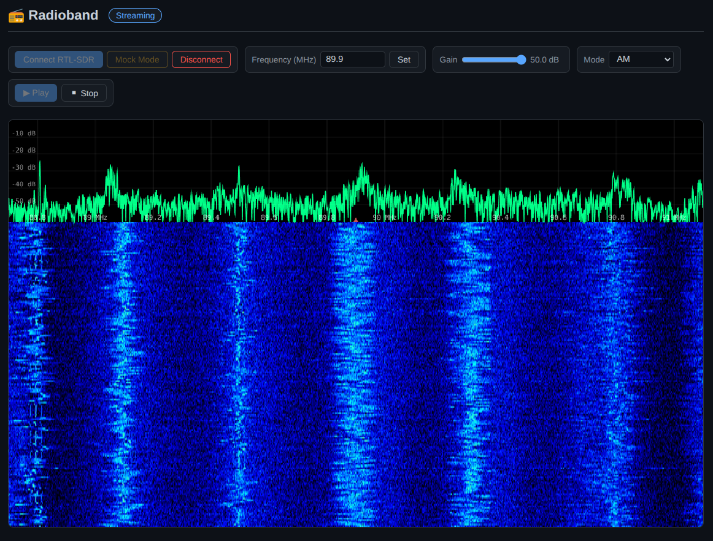

# 📻 Radioband


Browser-based SPA on **Rust + WebAssembly** for receiving FM / AM radio via
**RTL-SDR** (RTL2832U + R820T) through the **WebUSB** API.
Runs entirely in the browser — no server, no native driver, no extensions.

DEMO: https://hightemp.github.io/radioband/



## Features

| Feature | Status |
|---|---|
| WebUSB connection to RTL-SDR | ✅ |
| WFM / NFM / AM demodulation | ✅ |
| Spectrum + waterfall display | ✅ |
| Audio playback via AudioWorklet | ✅ |
| Mock IQ mode (no hardware) | ✅ |
| GitHub Pages deployment | ✅ |

## Architecture

```
┌─────────────────────────────────────────────────┐
│  Main thread  (app-ui WASM)                     │
│  ├─ DOM / UI event handlers                     │
│  ├─ WebUSB device management (usb-rtl)          │
│  ├─ Canvas waterfall renderer                   │
│  └─ AudioBridge (audio-bridge)                  │
│         │ postMessage           │ MessagePort    │
│         ▼                       ▼                │
│  ┌───────────┐       ┌────────────────────┐     │
│  │  Worker    │       │ AudioWorkletNode   │     │
│  │  (sdr-     │       │ (PCM ring-buffer   │     │
│  │   worker   │       │  processor.js)     │     │
│  │   WASM)    │       └────────────────────┘     │
│  └───────────┘                                   │
└─────────────────────────────────────────────────┘
```

**Crates**

| Crate | Purpose |
|---|---|
| `sdr-core` | Pure-Rust DSP: FFT, FM / AM demod, decimation, de-emphasis |
| `usb-rtl` | WebUSB driver for RTL2832U + R820T |
| `audio-bridge` | Web Audio API (AudioWorklet) bridge |
| `sdr-worker` | Web Worker entry point (DSP pipeline) |
| `app-ui` | Main-thread UI, canvas, glue |

## Requirements

* Chromium ≥ 89 (WebUSB + AudioWorklet)
* Rust stable + `wasm32-unknown-unknown` target
* `wasm-bindgen-cli` (same version as the `wasm-bindgen` dependency)
* `trunk` (for building the main app)

## Quick Start

```bash
# Install tools (once)
rustup target add wasm32-unknown-unknown
cargo install wasm-bindgen-cli trunk

# Build everything
./build.sh

# Serve locally (HTTPS required for WebUSB)
# Option A — trunk dev server with auto-reload:
trunk serve --open
# Option B — any static server over HTTPS:
npx serve docs
```

## Mock Mode

Click **Mock Mode** to run without hardware.  The worker generates a synthetic
FM-modulated carrier with an 800 Hz test tone so you can verify the full
pipeline (FFT → spectrum → waterfall → FM demod → audio).

## Development

```bash
# Pre-build the worker once
export RUSTFLAGS='--cfg=web_sys_unstable_apis'
cargo build --target wasm32-unknown-unknown --release -p sdr-worker
wasm-bindgen target/wasm32-unknown-unknown/release/sdr_worker.wasm \
    --out-dir static/worker-pkg --target no-modules --no-typescript --omit-default-module-path

# Then iterate on the main app with hot-reload
trunk serve
```

## License

MIT
